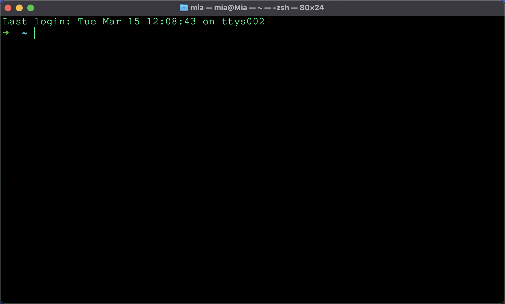
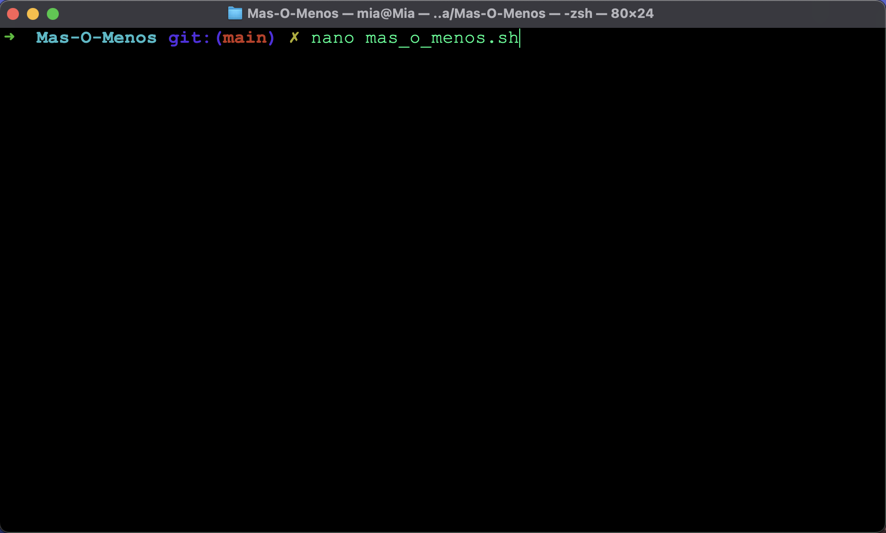
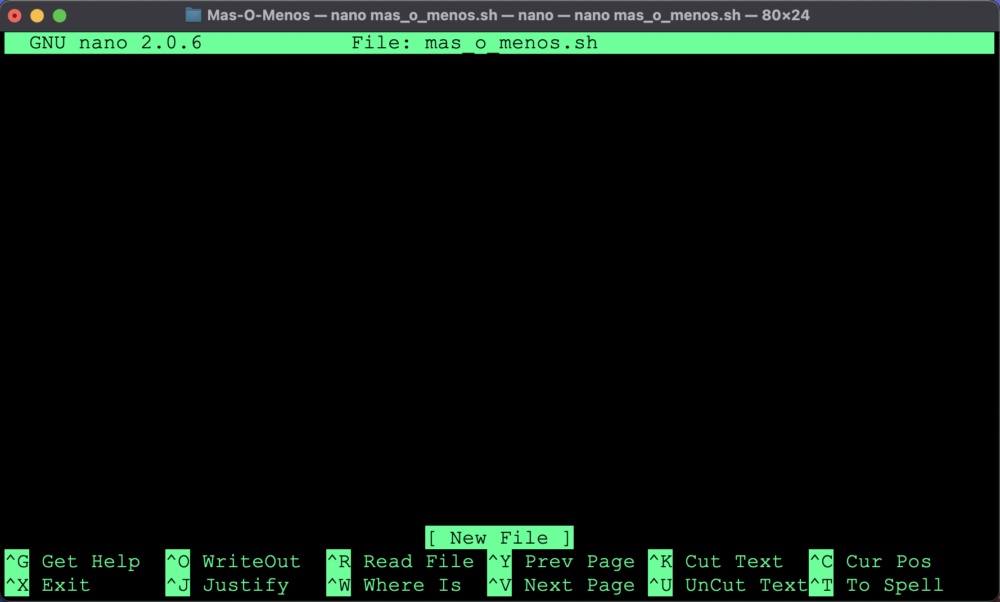
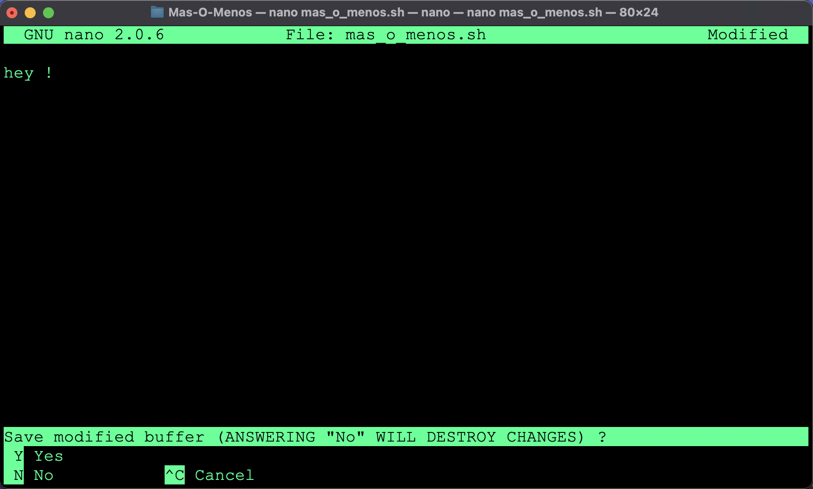

# 42 Barcelona - Mas O Menos
> En este tutorial, aprenderás paso a paso a hacer un pequeño juego en Shell Script

## Nivel 0: *Hola 42 !*

### Abrir un Shell
- Abre un terminal en tu ordenador

#### Linux
> Este paso es sólo para usuarios de Linux
- Pulsa `Ctrl` + `Alt` + `T`

#### MacOS
> Este paso es sólo para usuarios de MacOS
- Pulsa `Command` + `Space`, luego escribe `term` y haz clic en la aplicación que quieras lanzar

Deberías terminar con algo como esto:



### Crear y editar un archivo
En la terminal, usamos esta sintaxis
```bash
comando --opciones argumentos
```
- Vamos a utilizar el comando `nano`, que es un editor de texto básico
- Daremos como argumentos el nombre del archivo que queremos crear `mas_o_menos.sh`
- La línea de comandos completa será así `nano mas_o_menos.sh`

- Pulsa `enter` para ejecutarlo

### Use Nano
- Tu archivo debe contener esta línea, escríbela:
```bash
echo '¡Hola 42!'
```

- Presiona `Ctrl` + `x` para guardar tu archivo

- Pulsa `y` para confirmar

- Pulse `Enter` para salir

### Ejecuta tu programa
Es el momento de ver lo que has hecho
- Ejecuta tu programa con el comando `bash mas_o_menos.sh`

¡Bien hecho, has hecho $tu primer Hola Mundo !

## Nivel 1: ¡Juguemos!

### Elige un intérprete
- Indica el intérprete a utilizar para ejecutar tu script, la primera línea debe ser exactamente
`#!/usr/bin/env bash`

 Tu archivo debe tener el siguiente aspecto
 ```bash
 #!/usr/bin/env bash

 echo '¡Hola 42!'
 ```

### No es un archivo, es un programa
- Dile al ordenador que trate tu archivo como un programa dándole permiso de ejecución
- Ejecuta `chmod +x mas_o_menos.sh`

Tu archivo es ahora ejecutable, puedes ejecutarlo escribiendo `./mas_o_menos.sh`

### Variable
> Vas a modificar tu archivo, para imprimir en la terminal el contenido de la variable MENSAJE, podrás cambiar el mensaje impreso cambiando el valor de la variable
- En su fichero, sustituya `'¡Hola 42!'` por `MENSAJE`.
- Añade una línea justo encima para establecer el valor de la variable MENSAJE: `MENSAJE='¡Hola 42!'`

Su archivo para que coincida con el siguiente:
```bash
#!/usr/bin/env bash

MENSAJE='¡Hola 42 !'
echo $MENSAJE
```
- Guarda y prueba tu programa ejecutando `./mas_o_menos.sh`

### Habla conmigo
> Harás que tu programa pueda preguntar algo al usuario y obtener una respuesta
- Añade una línea al final del archivo: `read RESPUESTA`
- Y otra para mostrar la respuesta: `echo $RESPUESTA`

Tu archivo debería tener este aspecto
```bash
#!/usr/bin/env bash

MENSAJE='¡Hola 42!'
echo $MENSAJE
read RESPUESTA
echo $RESPUESTA
```
- ¡Guarda y ejecuta tu programa para probarlo !

### No pasarás
> Aprenderás a hacer tu programa inteligente
- Actualiza el valor del MENSAJE para preguntar la edad del usuario: `echo '¡Hola 42! ¿Cuál es la respuesta?'`
- Añade estas líneas al final del archivo para comprobar si la edad es igual a 42
> Ten cuidado con los caracteres especiales como los espacios y las comillas
```bash
if [ "$RESPUESTA" = 42 ]
then
	echo '¡Bienvenido a los 42!'
else
	echo '¡No pasarás!'
fi
```

- Guarda y prueba, también puedes eliminar la línea: `echo $RESPUESTA`

Tu archivo debería tener el siguiente aspecto
```bash
#!/usr/bin/env bash

MENSAJE='¡Hola 42! ¿Cuál es la respuesta?'

echo $MENSAJE
read RESPUESTA

if [ "$RESPUESTA" = 42 ]
then
	echo '¡Bienvenido a 42!'
else
	echo '¡No pasarás!'
fi
```

### De nuevo
> Aprenderás a hacer un bucle para no escribir dos veces el mismo trozo de código
- Añade entre `MENSAJE='¡Hola 42! ¿Cuál es la respuesta?'` y `echo $MENSAJE` lo siguiente
```bash
while true
do
```
- Y después de la línea `fi`, añade `done`

Tu archivo debería ser así:
```bash
#!/usr/bin/env bash

MENSAJE="¡Hola 42! ¿Cuál es la respuesta?"
while true
do
  echo $MENSAJE
  read RESPUESTA

  if [ "$RESPUESTA" = 42 ]
  then
    echo '¡Bienvenido a 42!'
  else
    echo '¡No pasarás!'
  fi
done
```

- Ejecuta tu programa para probarlo, pulsa `Ctrl` y `C` para salir

### El final
> Añade una salida a tu programa
- Entre la línea `echo '¡Bienvenido al 42!'` y la línea `else` añade `exit 0`

### Más O Menos
> Implementarás el juego más o menos, el objetivo es encontrar un número oculto en el menor número de intentos posibles
- Bajo `MENSAJE=`, añade `SECRETOO=$(date +%s | rev | cut -c1-2)`
> Esta línea de comando **mágica** `$(date +%s | rev | cut -c1-2)` generará un **número arbitrario entre `00` y `99`** (ambos incluidos), no intentes entenderlo
- En la línea: `if [ "$RESPUESTA" = 42 ]`
  - Reemplace `42` por `"$SECRETOO"`.
  - Debería ser como `if [ "$RESPUESTA" = "$SECRETOO" ]`
- Sustituye la línea `MENSAJE=...` por `MENSAJE="¡Hola a los 42! ¿Cuál es la respuesta?"`
- Añadirá una pista:
  - Añade una línea para comprobar si es mayor o menor que el número secreto
  - Debajo de `echo 'You shall not pass !'`, añade lo siguiente:
```bash
if [ "$SECRETOO" -gt "$RESPUESTA" ]
then
	echo "¡El número secreto es mayor!"
else
	echo "¡El número secreto es menor!"
fi
```
- Puedes guardar e intentar jugar
> Puedes jugar con un amigo, recorrido por recorrido el primero que lo devina gagna

Tu archivo debria ser como eso:
```bash
#!/usr/bin/env bash

MENSAJE='¡Hola 42! ¿Cuál es la respuesta?'
SECRETO=$(date +%s | rev | cut -c1-2)
while true
do
  echo $MENSAJE
  read RESPUESTA

  if [ "$RESPUESTA" = "$SECRETO" ]
  then
	echo '¡Bienvenido a 42!'
	exit 0
  else
    echo '¡No pasarás!'
	if [ "$SECRETO" -gt "$RESPUESTA" ]
then
	echo "¡El número secreto es mayor!"
else
	echo "¡El número secreto es menor!"
fi
  fi
done
```

### Counter
> Vas a cuentar la veces que usas
- Defina la valor del cuento a `0`
Antes `while`:
- añada `CUENTO=0`
despues `read`:
- añada `CUENTO="$(($CUENTO + 1))"`
Antes `exit 0`
- añada `echo "Score:    - $CUENTO"`

Tu archivo debria ser asi:
```bash
#!/usr/bin/env bash

MENSAJE='¡Hola 42! ¿Cuál es la respuesta?'
SECRETO=$(date +%s | rev | cut -c1-2)
CUENTO=0
while true
do
  echo $MENSAJE
  read RESPUESTA
  CUENTO="$(($CUENTO + 1))"

  if [ "$RESPUESTA" = "$SECRETO" ]
  then
	echo '¡Bienvenido a 42!'
	echo "Score:    - $CUENTO"
	exit 0
  else
    echo '¡No pasarás!'
	if [ "$SECRETO" -gt "$RESPUESTA" ]
	then
	  echo "¡El número secreto es mayor!"
    else
	  echo "¡El número secreto es menor!"
    fi
  fi
done
```
